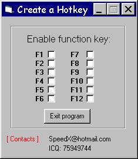



## Using Hotkeys

### Description

An Example how to use and create hotkeys

If you Download, Please rate it first.

You can do me a favour if you do that!

Thanks.
 
### More Info
 

             |
---                |---
**Submitted On**   |2001-06-30 13:34:22
**By**             |[Frank Frieswijk](https://github.com/Planet-Source-Code/PSCIndex/blob/master/ByAuthor/frank-frieswijk.md)
**Level**          |Intermediate
**User Rating**    |4.5 (36 globes from 8 users)
**Compatibility**  |VB 6\.0
**Category**       |[Files/ File Controls/ Input/ Output](https://github.com/Planet-Source-Code/PSCIndex/blob/master/ByCategory/files-file-controls-input-output__1-3.md)
**World**          |[Visual Basic](https://github.com/Planet-Source-Code/PSCIndex/blob/master/ByWorld/visual-basic.md)
**Archive File**   |[Using Hotk22056722001\.zip](https://github.com/Planet-Source-Code/frank-frieswijk-using-hotkeys__1-24607/archive/master.zip)

